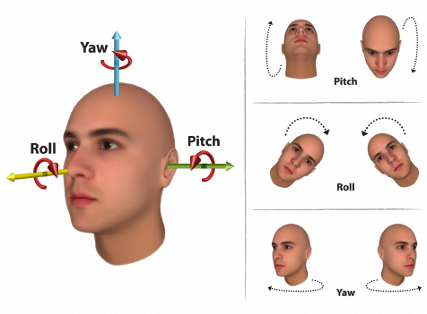
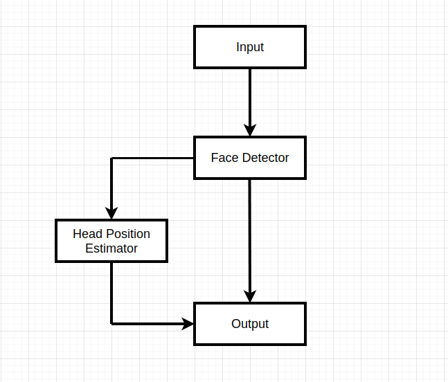
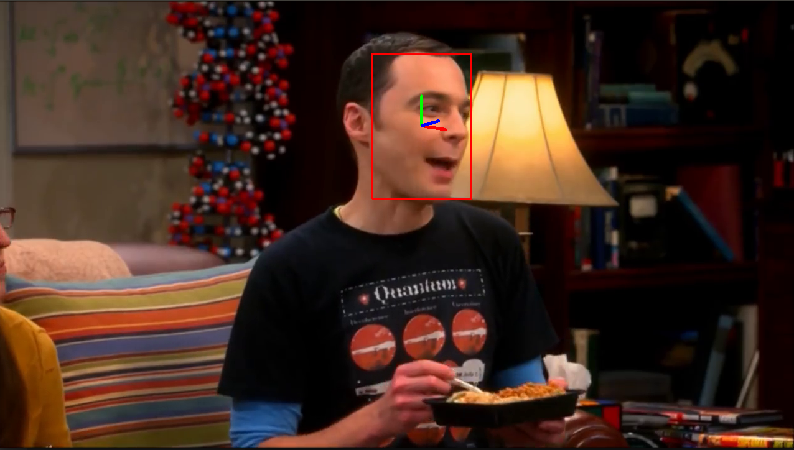

= Head Pose Estimation
:idprefix:
:idseparator: -
:sectanchors:
:sectlinks:
:sectnumlevels: 6
:sectnums:
:toc: macro
:toclevels: 6
:toc-title: Table of Contents

toc::[]

== Introduction
Head position is the core to analyze human behavior and attention and plays a very important role in interpersonal communication. Head pose estimation refers to the computer through the input image or video sequence analysis, prediction, determine the human head in the three-dimensional space. This solution can use in the driver monitoring system and can estimate the driver's inattention. 

== Architecture Block Diagram

== Prerequisites

To run the application in this tutorial, the OpenVINO™ toolkit and its dependencies must already be installed and verified using the included demos. Installation instructions may be found at: https://software.intel.com/en-us/articles/OpenVINO-Install-Linux or https://github.com/udacity/nd131-openvino-fundamentals-project-starter/blob/master/linux-setup.md

The below steps are tested on Ubuntu 16.04:

[source,bash]
----
# Install OpenVino
wget http://registrationcenter-download.intel.com/akdlm/irc_nas/16057/l_openvino_toolkit_p_2019.3.376.tgz
tar -xvf l_openvino_toolkit_p_2019.3.376.tgz
cd l_openvino_toolkit_p_2019.3.376 
sed -i 's/decline/accept/g' silent.cfg
sudo ./install.sh -s silent.cfg

# Install Nodejs and its dependencies
curl -sSL https://deb.nodesource.com/gpgkey/nodesource.gpg.key | sudo apt-key add -
VERSION=node_6.x
DISTRO="$(lsb_release -s -c)"
echo "deb https://deb.nodesource.com/$VERSION $DISTRO main" | sudo tee /etc/apt/sources.list.d/nodesource.list
echo "deb-src https://deb.nodesource.com/$VERSION $DISTRO main" | sudo tee -a /etc/apt/sources.list.d/nodesource.list
sudo apt-get update
sudo apt-get install nodejs

# System dep
sudo apt update
sudo apt-get install python3-pip
pip3 install numpy
pip3 install paho-mqtt
sudo apt install libzmq3-dev libkrb5-dev
sudo apt install ffmpeg
sudo apt-get install cmake

# Create a virtual env
python3.5 -m venv openvino_p3
source openvino_p3/bin/activate
pip3 install dlib paho-mqtt fysom imutils

# Project dep
# To-do: Create a requirements.txt for project specfic
pip3 install 
----

== Build

**1.** Clone the repository at desired location:

[source,bash]
----
https://github.com/nullbyte91/head-pose-estimation.git
----

**2.** Configure the build environment for the OpenCV
toolkit by sourcing the "setupvars.sh" script.

[source,bash]
----
source /opt/intel/openvino/bin/setupvars.sh -pyver 3.5
----

**3.** Change to the top git repository:

[source,bash]
----
cd head-pose-estimation

# Download models
bash scripts/download_models.sh

# Inference
python3 main.py -i resource/test_0.mp4 -m_fd mo_model/intel/face-detection-adas-binary-0001/FP32-INT1/face-detection-adas-binary-0001.xml -m_hp mo_model/intel/head-pose-estimation-adas-0001/FP32/head-pose-estimation-adas-0001.xml
----

== Output

